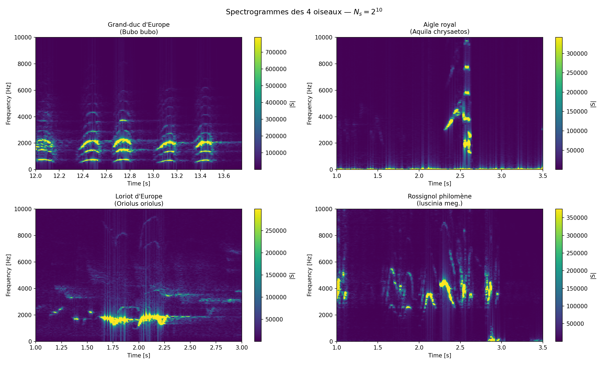
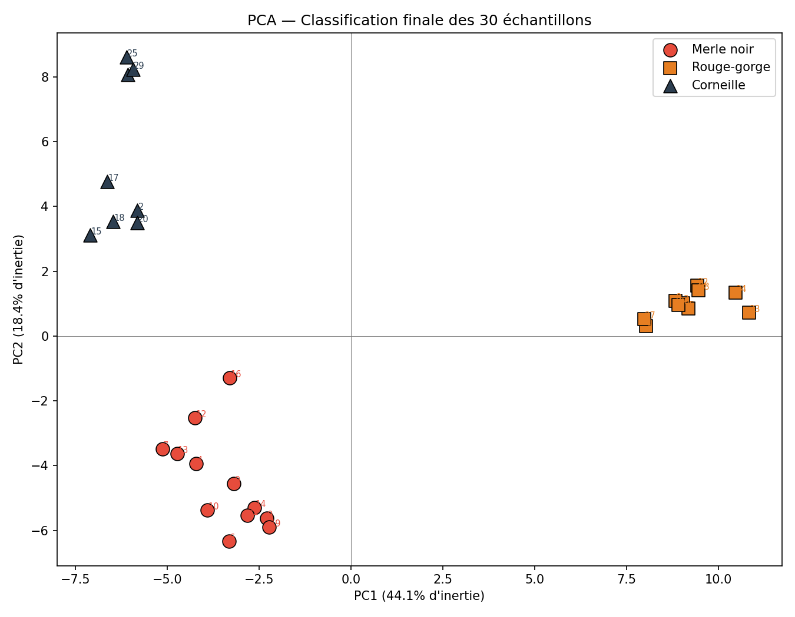
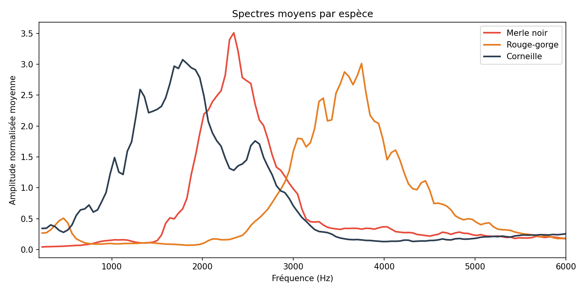

# Le chant des oiseaux : STFT et analyse en composantes principales

> **EN —** Two-part data analysis project. (1) A short-time Fourier transform written in NumPy, used to study the time-frequency trade-off and to compare the spectrograms of four bird species. (2) Automatic identification of 30 unlabelled recordings: each one is summarised by its normalised mean spectrum, a PCA coded from scratch via SVD separates three clusters, and three labelled recordings assign a species to each cluster.

*Projet final d'analyse de données, ESPCI Paris - PSL, mars 2026. Réalisé en binôme par Maxime Rimbaud et Romain Bertin.*

## Partie 1 : visualiser un chant

On découpe le signal en segments de N_s échantillons qui se recouvrent à 50 %, et on applique une transformée de Fourier discrète à chacun. La fonction `stft` est écrite avec NumPy seul.

- **Compromis temps-fréquence :** une fenêtre courte (N_s = 64) localise bien les cris dans le temps mais étale les fréquences ; une fenêtre longue (N_s = 4096) fait l'inverse. N_s = 1024 est un bon compromis pour ces signaux.
- **Validation :** le spectrogramme obtenu a la même structure que celui de `scipy.signal.stft`.
- **Signatures par espèce :** le grand-duc a un spectre grave, avec des harmoniques en arc autour de 2 kHz ; le rossignol émet des motifs brefs et modulés entre 2 et 6 kHz.

<p align="center"></p>

## Partie 2 : identifier l'espèce

1. **Descripteur :** pour chaque enregistrement, on calcule le spectre moyen dans le temps, restreint à la bande 200-6000 Hz, puis normalisé par son écart-type. Cela donne une matrice de 30 lignes (enregistrements) et 124 colonnes (fréquences).
2. **ACP codée à la main :** on centre la matrice puis on la décompose en valeurs singulières. Les deux premières composantes portent 44,1 % et 18,4 % de l'inertie, soit 62,5 % au total.
3. **Identification :** trois enregistrements dont l'espèce est connue servent de référence. Chaque autre enregistrement reçoit l'espèce de la référence la plus proche dans le plan (PC1, PC2).

**Résultat :** les 30 enregistrements forment trois groupes nettement séparés : 12 merles noirs, 10 rouges-gorges et 8 corneilles.

Les étiquettes des 27 autres enregistrements ne sont pas connues, donc on ne peut pas calculer de taux de bonne classification. Ce qui valide le résultat, c'est la netteté de la séparation et la cohérence des spectres moyens de chaque groupe.

<p align="center">
  
  
</p>

**Interprétation :** PC1 oppose les graves aux médiums-aigus et isole le rouge-gorge. PC2 sépare la corneille du merle noir.

## Fichiers

| Fichier | Contenu |
|---|---|
| `visualisation_stft.py` | Partie 1 : STFT, effet de N_s, comparaison avec SciPy, spectrogrammes |
| `identification_acp.py` | Partie 2 : descripteurs, ACP par SVD, identification des espèces |
| `figures/` | Figures générées par les scripts |

## Données

Les enregistrements audio ont été fournis avec l'énoncé et ne sont pas redistribués ici. Pour relancer les scripts, il faut un dossier contenant :

```
part1/  hibou_grand_duc.wav, aigle_royal.wav, loriot.wav, rossignol.wav
part2/  sample_0.wav ... sample_29.wav
```

Passez ce dossier en argument, ou placez-le dans `data/`.
